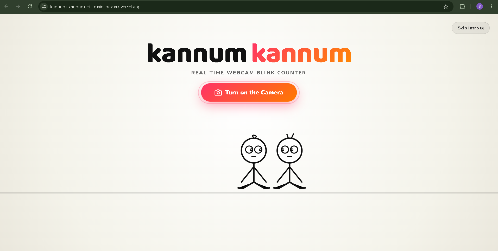
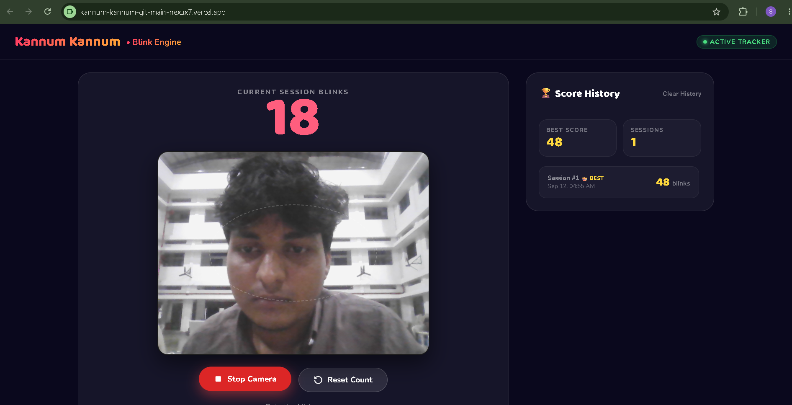
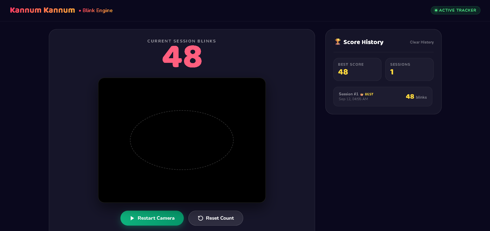
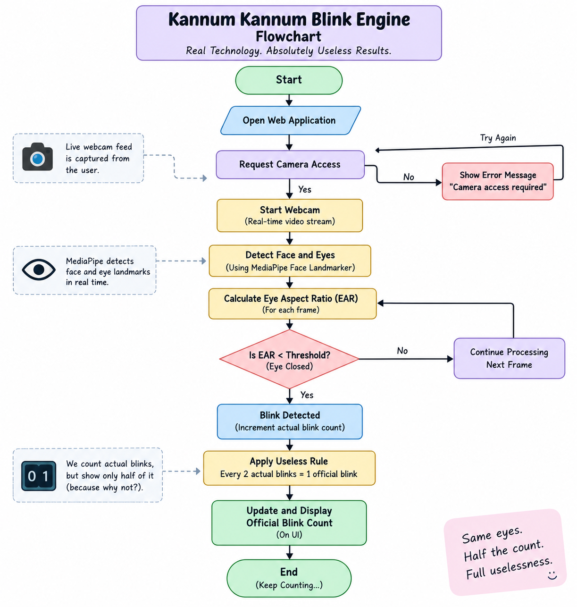

# Kannum Kannum 🎯

## Basic Details
### Team Name: NEXUX

### Team Members
- Team Lead: Sayuj Peter Sajan - Jyothi Engineering College
- Member 2: Muhammed Shiyas M - Jyothi Engineering College

### Project Description
Kannum Kannum is an over-engineered real-time webcam blink counter powered by Google MediaPipe Face Landmarker. Featuring a slapstick 2D cartoon hero animation and a delightfully inverted counting logic (a slow blink counts as 2, while a rapid double blink counts as 1), it turns involuntary eyelid twitches into a competitive sport with persistent session score tracking.

### The Problem (that doesn't exist)
For centuries, humans have blinked upwards of 20,000 times a day completely unmonitored and without any biometric accountability. Even worse, traditional arithmetic stubbornly dictates that "one blink equals one blink," entirely ignoring the emotional weight of a dramatic slow blink versus the nervous panic of a rapid double-flutter.

### The Solution (that nobody asked for)
We deployed a full 468-point facial landmark computer vision model directly into the browser using Eye Aspect Ratio (EAR) geometry to judge eyelid velocity. If you execute a slow, deliberate blink, you are rewarded with 2 blinks. If you nervously spam two fast blinks, the system deducts a point to award you only 1 net blink. All of this is preceded by an exaggerated 10-second slapstick cartoon where two goofy stickmen collide into a cloud of smoke and dizzy orbiting stars before your camera even turns on.

## Technical Details
### Technologies/Components Used
For Software:
-  JavaScript (ES6+ Modules), HTML5, CSS3
- None
- @mediapipe/tasks-vision (MediaPipe Face Landmarker), Web APIs (getUserMedia)
- Node.js, serve, Visual Studio Code, Antigravity, Chrome DevTools

### Implementation
For Software:
# Installation

git clone https://github.com/sayuj-00/Kannum-Kannum-Blink-Engine.git
cd Kannum-Kannum-Blink-Engine

# Run
npm run dev

### Project Documentation
For Software:

# Screenshots

### Screenshot 1 — Landing Page

*The landing page of Kannum Kannum Blink Engine, introducing the project and allowing the user to start the blink detection system.*

### Screenshot 2 — Real-Time Blink Detection

*The application uses the webcam and MediaPipe Face Landmarker to detect the user's eyes and identify blinks in real time.*

### Screenshot 3 — Blink Counter Result

*The application displays the detected blink count and the intentionally useless blink calculation.*
# Diagrams

*The workflow illustrates the complete process of Kannum Kannum Blink Engine, from webcam access and real-time facial landmark detection using MediaPipe to eye-aspect-ratio analysis, blink detection, and application of the intentionally useless rule where every two actual blinks are counted as one official blink*

### Project Demo
# Video
https://drive.google.com/file/d/1-iWSr7ED3Wk1wWs6fCgaQozqkd9x2d5q/view?usp=sharing
*The video demonstrates the Kannum Kannum Blink Engine in action, including starting the webcam, detecting real-time eye blinks using MediaPipe Face Landmarker, counting the detected blinks, and applying the project's intentionally useless 2-blinks-equals-1-blink rule.*

## Team Contributions
- Sayuj Peter Sajan: ** Developed the real-time blink detection system using MediaPipe Face Landmarker, implemented eye landmark tracking and EAR-based blink detection, integrated webcam functionality, and handled the core project implementation.
- Muhammed Shiyas M: ** Designed and developed the user interface, animations, visual elements, and overall user experience of the application.
  

---
Made with ❤️ at TinkerHub Useless Projects 

